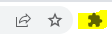
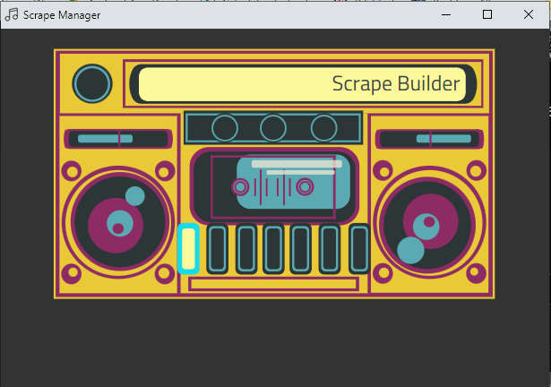
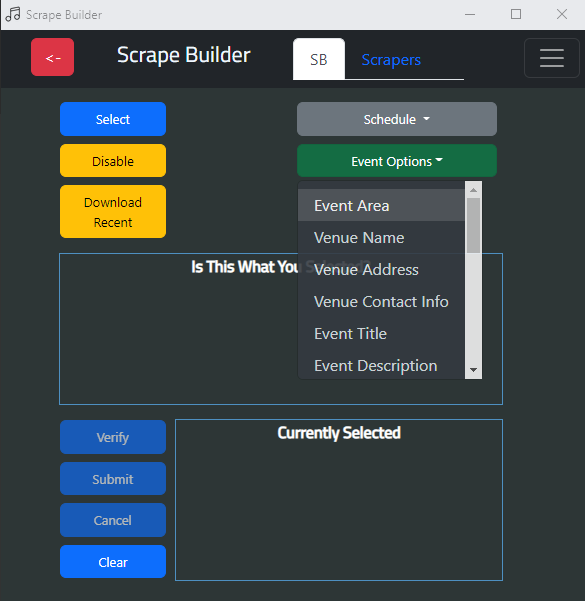
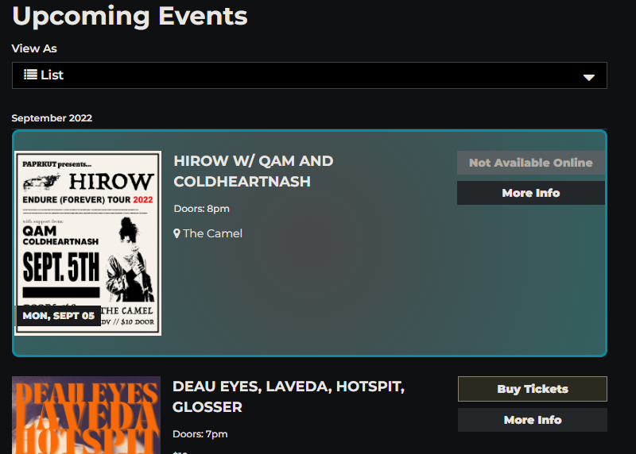
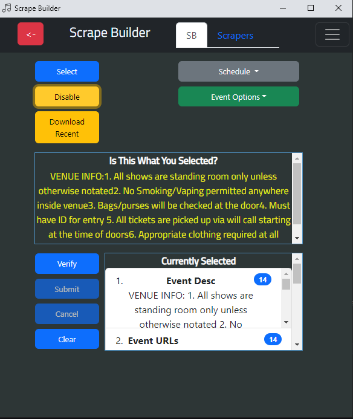
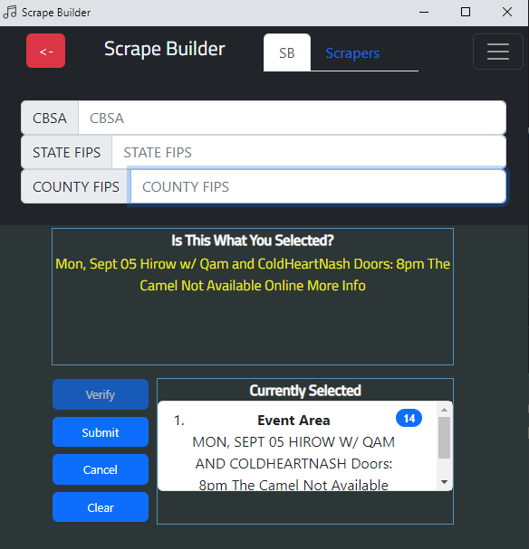
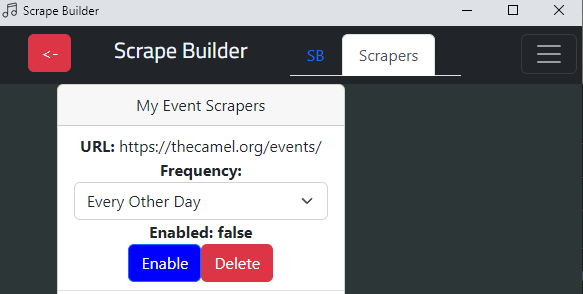
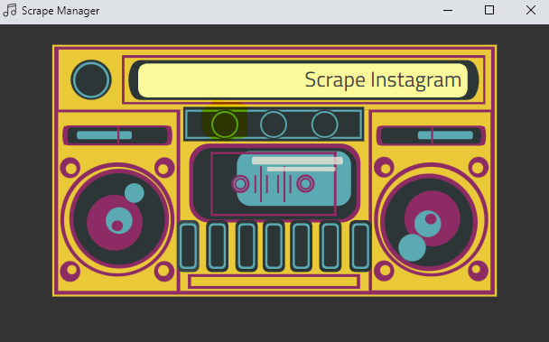

# live-music-archiver-extension

This is a Chrome Extension that allows a user to define and scrape musical event information from a website and schedule it to run periodically. 
This is entended for research purposes.

## Installation

1. Clone this repository
2. Open Chrome and navigate to `chrome://extensions`
3. Enable Developer Mode
4. Click "Load Unpacked" and select the `live-music-archiver-extension` directory
5. Locate the extension in the list of extensions and click to open. 

## Usage

1. The main "Manager" page should open automatically. If you are not signed into your Google account, you will be unable to use the extension.
2. There are currently two available options for scraping: Scrape Builder and Instagram Scraper.

### Scrape Builder

1. There are a variety of options for scraping. The first is the only *required* option, "Event Area". This is the area for which an entire event exists on the page.

2. To Select an event item, click the "Select" button and highlight the area of the page that contains the event information.

3. Continue to select the other event items. If you need to change the event area, click the "Clear" button and start over.
4. If you need to navigate to another page (for example, a details page) to get more information, click _Select_ the Event URLs item and highlight the button or link that will take you to the details page. Once that is defined click "Disable" to allow the extension to navigate to the details page.

5. Optional metadata can be added from the hamburger menu. This will be added to the event data.

5. Once you have defined all of the event items, click "Verify" to save the scrape. The extension will attempt to scrape the page and display the results. If the results are not what you expected, you can click "Clear" to start over.
6. If the results are correct, click "Submit" to save the scrape. The scrape will be added to the list of available scrapes.
7. You can modify your running scrapes by navigating to the "Scrapers" tab.

8. A "Download Recent" button is available to download the most recent scrape results. This will download a CSV file with the results.

### Instagram Scraper

1. The Instagram Scraper is a simple tool used to scrape Instagram posts.
2. Enter the Instagram username and Schedule and click "Scrape". The extension will scrape the page and all of the followers of the user.
3. The Profiles tab will allow you to modify the scrape. You can adjust or remove profiles from the scrape.
4. Due to the nature of Instagram, the extension will pull post _very_ slowly. This is to avoid being blocked by Instagram.
5. The "Download Recent" button will download a RAW JSON file with the results.

## Additional Information
- The extension is currently set to point to a remote server. If you would like to run the server locally, you can clone the [live-music-archiver-api](https://github.com/broem/live-music-archiver-api) repository and follow the instructions in the README.

## Contributing
Pull requests are welcome. For major changes, please open an issue first to discuss what you would like to change.